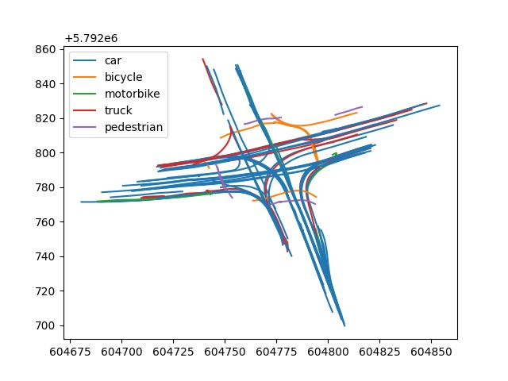

# TrAffic Situation analysis and Interpretation

[](https://pypi.python.org/pypi/tasi/) [](https://doi.org/10.5281/zenodo.14034644) [](https://www.dlr.de/en/ts/about-us/the-institute-of-transportation-systems) [](https://pepy.tech/projects/tasi)  

<p align="center">
    
</p>

TASI is a library to provide high-performance, easy-to-use data structures and data analysis tools for Python based
traffic situation analysis and interpretation applications.

> **TASI** is backed by those wonderful libraries [`Numpy`](https://numpy.org/), [`Pandas`](https://pandas.pydata.org/),
> and [`Numba`](http://numba.pydata.org/)

## Getting started

Install ``TASI`` from the PyPi registry.
```bash
pip install tasi
```

### Project Architecture
- `tasi.pose`: single object pose/timepoint representation
- `tasi.trajectory`: ordered trajectory sequences of poses
- `tasi.dataset`: multi-entity dataset collections and filtering
- `tasi.io`: conversion to/from pydantic models and ORM
- `tasi.dlr`: dataset download manager for DLR datasets

### Contribution and Branching
1. Fork the repository and create a feature branch:
   `git checkout -b improvements/<topic>`
2. Add tests for new behavior under `tasi/tests`
3. Run tests: `pytest`
4. Open a PR and link to related issues

Download the latest DLR-UT version for demonstration purpose.
```python
from tasi.dlr import DLRUTDatasetManager, DLRUTVersion, 

dataset = DLRUTDatasetManager(DLRUTVersion.latest)
dataset.load()
```

and visualize the trajectories within the dataset using `matplotlib`.

```python
from tasi.dlr import DLRTrajectoryDataset
from tasi.plotting import TrajectoryPlotter

import matplotlib.pyplot as plt

# load the first file of the dataset
ds_ut = DLRTrajectoryDataset.from_csv(dataset.trajectory()[0])

# plot the trajectories
f, ax = plt.subplots()

plotter = TrajectoryPlotter()
plotter.plot(ds_ut, ax=ax)
```


