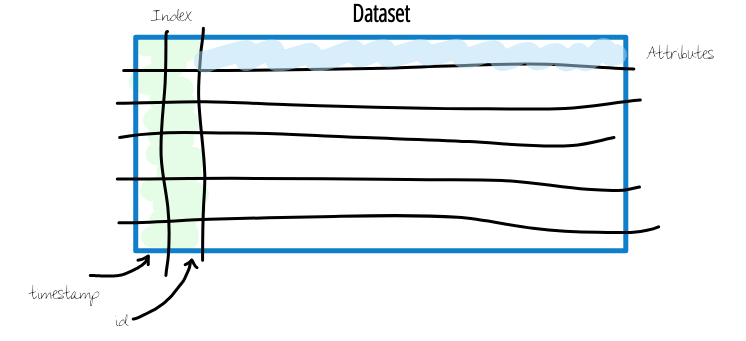
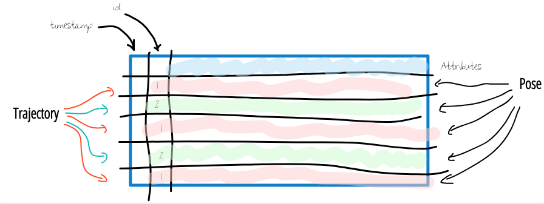

.. _getting_started:

.. currentmodule:: tasi

Getting started
#################

Hi there and welcome to the getting started guide of ``TASI`` 👋😀 This page shall help to get started right away with
instructions on how to install ``TASI`` and a description of the main ``TASI`` concepts. You may visit the following links
one after another. Note that the sections may contain links to external pages. It is recommended to visit those links
before continuing. If you have any questions regarding ``TASI``, feel free raise an issue. Happy reading 😁

Installation
--------------
An always up-2-date version of ``TASI`` is available via the `Pypi <https://pypi.org/project/tasi/>`_ registry. So, to get started with ``TASI``, its just a
matter of installing tasi with

.. code-block:: bash

    pip install tasi

Basic concepts
---------------
Similar to `pandas`_ and `geopandas`_ in ``TASI``, we represent traffic data using a tabular-styled format. To achive this,
``TASI`` extends `pandas`_  and `geopandas`_ to provide functionality for traffic data analysis. The top-level model is
the :py:class:`Dataset`
as illustrated in :numref:`tasi_dataset`. Every row in a :py:class:`Dataset` contains information for a specific point
in time as attributes. That is, an attribute can be any relevant traffic information, e.g., the position of a traffic
participant or the rain intensity.

.. _tasi_dataset:

    The top level model for traffic data representation is the :py:class:`Dataset`.

Most of the time, we will work with information about the traffic participants that are represented in the
:py:class:`Dataset`. To make live a little bit easier, ``TASI`` uses a hierarchical view on trajectory data based on the
:py:class:`Dataset` as illustrated in :numref:`tasi_trajectory_data`. Since a :py:class:`Dataset` typically contains
information about multiple traffic participants, each having a trajectory, the :py:class:`Dataset` is a container for
multiple :py:class:`Trajectory`. This is denoted with the different `id` values and color encoded rows. Furthermore,
since a single row is a representation of a traffic participant's state in a specific point in time, the
:py:class:`Pose`

representation of a traffic participant's state for a specific point in time is  with the  class.

.. _tasi_trajectory_data:

    Hierarchical view on trajectory data.

Since ``TASI`` uses `Pandas`_ under the hood, head over to the official `pandas
User Guide <https://pandas.pydata.org/docs/user_guide/index.html>`_. Afterwards, you may head over to the :ref:`User
Guide <user_guide>` for some use-case related examples using
``TASI``. If you want to contribute to ``TASI``, visit :ref:`Development Documentation
<contribute>` for further instructions.

.. _pandas: https://pandas.pydata.org
.. _geopandas: https://geopandas.org/en/stable/
